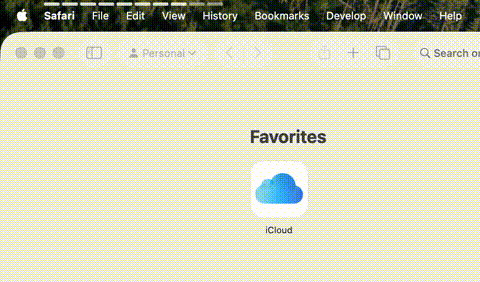

# Breathe Together

A tiny breathing bar that sits on your screen. Follow the rhythm. Calm down.

Everyone sees the same bar, same rhythm, same breath. Sync up and feel the flow.

Turn on online sync and breathe with others. You're not alone in this.

Built this because anxiety sucks and breathing helps. Especially when you feel others doing it with you.



## Install

**Recommended — one command:**
```bash
curl -sL https://raw.githubusercontent.com/smaiht/BreatheTogether/master/install.sh | bash
```

Or grab the `.dmg` from [Releases](https://github.com/smaiht/BreatheTogether/releases) — if it won't open, run:
```bash
xattr -cr "/Applications/Breathe Together.app"
```

---

0% CPU · 0 energy impact · runs entirely on GPU via Core Animation
